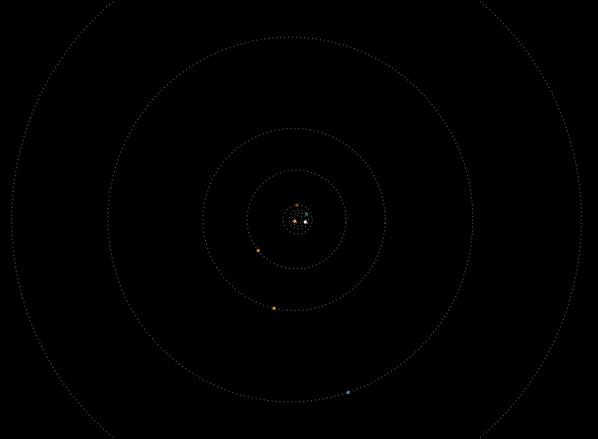

<h1 align="center">
   Hello, world!  
   My name's Eli.
</h1>

  I'm a high school student who loves to code.   

I started coding when I was around 9 years old and I've never stopped since. Along the way, I've made some pretty cool projects!

## [Tello For Dart](https://github.com/eliaxelang007/Tello-Dart)

ryze_tello, along with its utility package handy, is my first open-source project. It's a dart package that allows you to control Tello drones through code. It's something that I'm still developing.

<table>
  <tr>
    <td></td>
    <td></td>
  </tr>
</table>

## [Reaction Diffusion Simulation](https://gist.github.com/eliaxelang007/56605b6d0338d77d79dca658efe55b38)

Reaction-Diffusion Simulation is one of my projects that I built for fun. It's basically a remake of [The Coding Train's Reaction-Diffusion Algorithm](https://www.youtube.com/watch?v=BV9ny785UNc) in C++ with OpenCV.

<table>
  <tr>
    <td></td>
    <td></td>
  </tr>
</table>

## [Solar System Simulator](https://editor.p5js.org/eliaxelang007/sketches/b3U4nW7fS)

This project is another that I made for fun. It's a fairly simple p5js sketch that simulates the orbits of planets with actual planetary data. It isn't completely accurate though; it doesn't account for all planetary data, and I tweaked the numbers a little to make it more entertaining to watch.

<table>
  <tr>
    <td></td>
  </tr>
</table>

## [Bithacker](https://sharemygame.com/@eliaxelang007/bithacker)

I made this game as a part of a course I was taking to learn the Unity game engine. It's a block breaker game with a unique twist; the ball has a dash ability that charges up every so often that allows it to go zipping at crazy fast speeds to wherever you point it toward.

<table>
  <tr>
    <td></td>
  </tr>
</table>

## [The Starlight Nebula](https://sharemygame.com/@eliaxelang007/the-starlight-nebula)

The starlight nebula was another game I made as part of the same course that I made Bithacker in. It's basically Galaga with a bit fancier graphics.

<table>
  <tr>
    <td></td>
  </tr>
</table>

## [Python Prime Number Generators In C++](https://medium.com/@eli.axel.ang/python-prime-number-generators-in-c-dd4795f0a64c)

I've also written a [short article](https://medium.com/@eli.axel.ang/python-prime-number-generators-in-c-dd4795f0a64c) about recreating Python Prime Number Generators In C++.

<table>
  <tr>
    <td></td>
  </tr>
</table>
